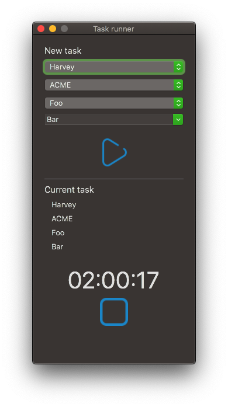
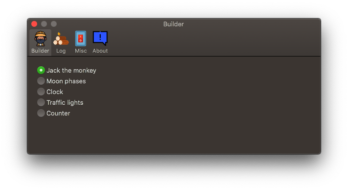

# Timetracker

Timetracker is an open source time tracker for macOS, released under the MIT license. The author stole the name from any of the 239487 apps that do something similar.

## Install

Download the latest version, unzip, move to the Applications folder and open. You will probably have to go to the System Preferences > Security & Privacy to allow the app to run.

## Screenshot

Timetracker takes uses the multi-window system macOS offers the apps out of the box. So in total you have 4 screenhots. The first three are accessible from the Window menu; the last from the Timetracker menu.

### Cost centres

### Task runner

### Task list

### Preferences

## How to use 

The idea behind Timetracker is that you have a Cost centre composed by a Head of Development (HoD). An HoD has several Clients which in its turn has several Projects. You can create these relationships in the Cost centre window.

After creating the Projects it's time to start tracking the time! Go to the Task runner window, select the HoD, Client and Project, set a name for you task and click on the big blue play icon! You will see the icon in the menu bar changing every second.

Once you're done with your task click on stop. Accessing the Task list window shows all the tasks you created. You can create, delete and edit tasks there as well.

## Development

### Requirements

If you wish to build Timetracker yourself, you will need the following components/tools:

* OS X SDK (10.15 or later)
* Git

### Environment setup

Open the project with XCode. Really. Nothing else is expected.

## FAQ

### Usage

#### The logic behind the app does not make sense...
> There is a big reason why there are HoD, Clients and Projects; and then tasks. The export is also the way it is for a reason.

#### The UI is crap!
> I know, and I appreciate help on that field :-)

#### Can I request a feature/improvement?
> Absolutely! Go to the issues and create a ticket for each. Please be short and precise on the request. 

### Development

#### Why is the code so bad/looks dated?
> I started this project to learn Swift in 2016. Some code is still compliant with old versions of Swift.
> I'm also not an every day developer so my programming skills might be rusty.

#### Why are there remains of Carthage/Cocoapods if the project is using Swift Package Manager?
> I started off with Cocoapods. Then later I tried integrating a library requiring Carthage but Gatekeeper was complaining the app was damaged when I exported it.
> Finally I decided to remove the big bloat that Cocoapods is and stick to a smaller dependency manager.
